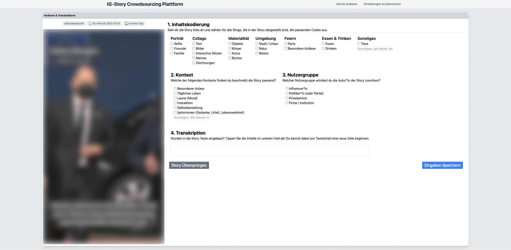
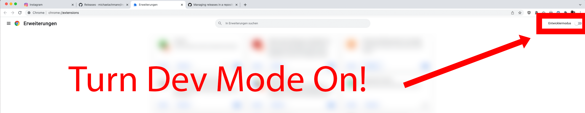
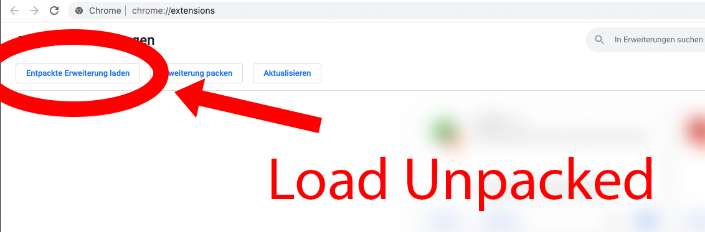

# ig-crowdsourcing

Chrome Extension to collect an Instagram Story corpus. Currently under developement. More Information: https://ig-lab.net

## Getting Started
Download the [latest release](https://github.com/michaelachmann/instagram-story-annotator/releases), unzip it and [add it to chrome](https://developer.chrome.com/docs/extensions/mv3/getstarted/#unpacked). 

1. Unpack the zip-Archive.

2. Go the the location `chrome://extensions/` in your chrome browser.

3. Turn the developement mode in chrome on:

   

4. Load the folder `extension` which you extracted in step one from the zip-Archive using the button "Load Unpacked":

## Development
1. Clone the repository

  `git clone instagram-story-annotator`

2. Init the submodule (the actual extension)

  `git submodule update --init --recursive`

2. Install dependencies
`yarn install`

4. Run Dev-Server
    `yarn serve`

5. Follow the steps above to add the extension to your browser.

## Documentation

Currently under Developement.
